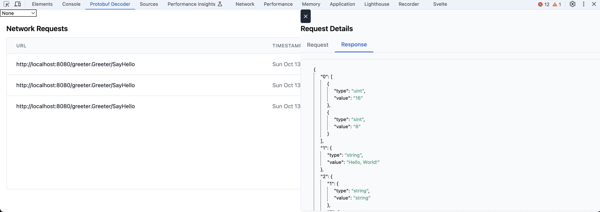
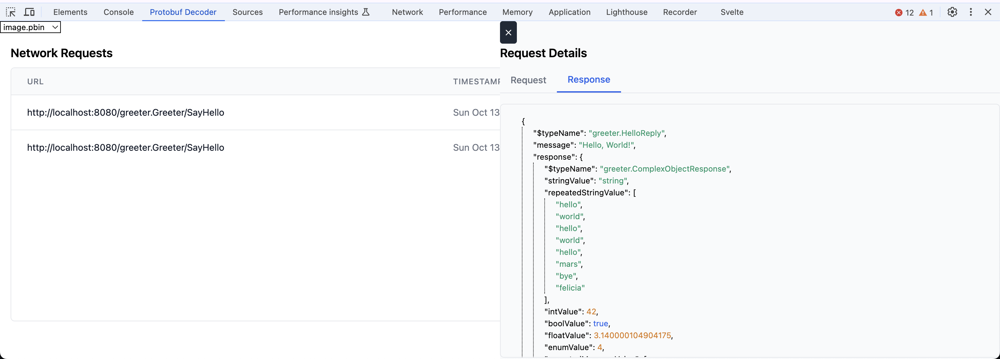

# Proto DevTools

Chrome Extension to decode protobuf binary in requests and responses

## Features

Attempt to decode protobuf binary in requests and responses from your browser

If you provide a [Buf Image](https://buf.build/docs/reference/images) then it can decode the messages in a much more readable manner

## Install

- Go to your `chrome://extensions/` in your browser
- Click `Load Unpacked`
- Point to the `./dist` folder in the root directory of the project
- Go to a website that sends protobuf messages
- Open your `Developer Tools`
- Look for a tab called `Protobuf Decoder`
- (Optional) if you have a Buf Image, drag and drop it in the panel and it should begin to parse messages automatically

## Screenshots

Example of a protobuf message attempting to be decoded

Example of a protobuf message being decoded with a Buf Image

## Roadmap

- [x] Test with ConnectRPC services
- [ ] Provide a better UI
- [ ] Support compressed messages
- [ ] Upload to chrome store
- [ ] Add proper testing
- [ ] Support errors returned - <https://connectrpc.com/docs/go/errors#error-details>
- [ ] Display timestamps in a readable format

## ChangeLog

[ChangeLog Format](https://common-changelog.org/)

## Tips

### Creating a Buf Image

Run `buf build --exclude-source-info -o image.pbin` in the directory with your buf

### Creating a file descriptor with protoc

\<TBD\>
